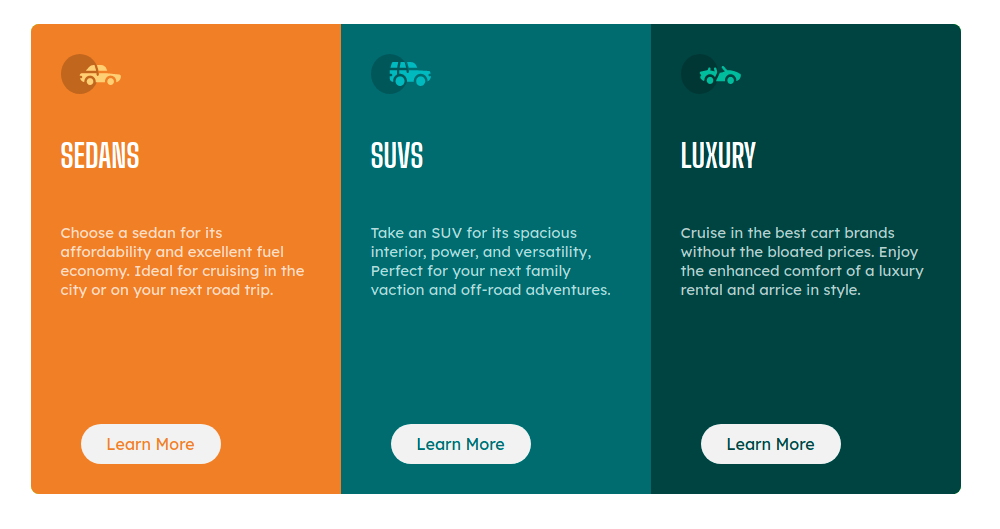
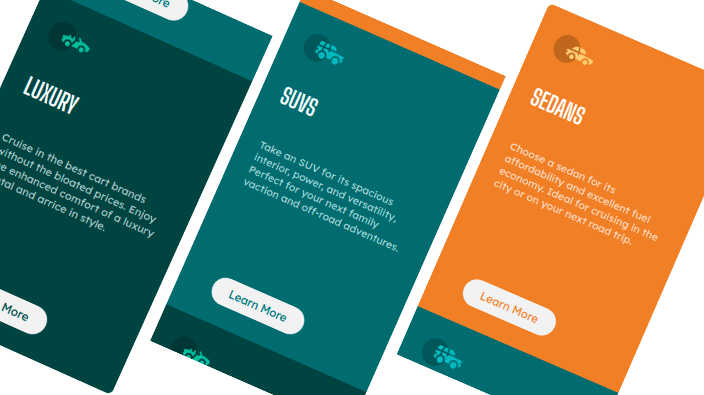

# Frontend Mentor - 3-column preview card component solution

This is a solution to the [3-column preview card component challenge on Frontend Mentor](https://www.frontendmentor.io/challenges/3column-preview-card-component-pH92eAR2-). Frontend Mentor challenges help you improve your coding skills by building realistic projects. 

## Table of contents

- [Overview](#overview)
  - [The challenge](#the-challenge)
  - [Screenshot](#screenshot)
  - [Links](#links)
- [My process](#my-process)
  - [Built with](#built-with)
  - [What I learned](#what-i-learned)
  - [Continued development](#continued-development)
  - [Useful resources](#useful-resources)
- [Author](#author)


## Overview

### The challenge

Users should be able to:

- View the optimal layout depending on their device's screen size
- See hover states for interactive elements

### Screenshot

### Design
- Desktop design

### output
- Desktop ui in HTML & CSS

- Mobile 


### Links

- Solution URL: [https://github.com/ahmedmohamedeid98/three-column-cart-component](https://github.com/ahmedmohamedeid98/three-column-cart-component)
- Live Site URL: [https://ahmedmohamedeid98.github.io/three-column-cart-component/](https://ahmedmohamedeid98.github.io/three-column-cart-component/)

## My process

### Built with

- Semantic HTML5 markup
- CSS custom properties
- Flexbox
- Mobile-first workflow
- Font Family: [Lexend Deca](https://fonts.google.com/specimen/Lexend+Deca) - 400 - For title style
- Font Family: [Big Shoulders Display](https://fonts.google.com/specimen/Big+Shoulders+Display) - 700 - For title

### What I learned

flex items will all try to fit onto one line. and we can change that and allow the items to wrap as needed with this property. 

```css
.container {
  flex-wrap: wrap;
}
```

to clip the content to parent container border raduis but note that **needs to have some defined boundaries**

```css
.container {
  height: 400px;
  withd: 500px;
  border-raduis: 8px;
  overflow: hidden;
}
```

to make flexable container fit its content size

```css
.container {
  withd: fit-content;
}
```

center conainer horizentally 

```css
.container {
  withd: fit-content;
  margin: auto;
}
```


### Useful resources

- [W3school](https://www.w3schools.com/css) - Still it is the best place to understand anything related to web technology.
- [Guide to Felxbox](https://css-tricks.com/snippets/css/a-guide-to-flexbox/) - This is an amazing article which helped me finally understand important concept about flexbox. I'd recommend it to anyone still learning this concept.


## Author

- Website - [Ahmed Eid](https://www.your-site.com)
- Frontend Mentor - [@ahmed eid](https://www.frontendmentor.io/profile/ahmedmohamedeid98)
- LinkedIn - [@ahmed eid](https://www.linkedin.com/in/ahmedmohamedeid/)

